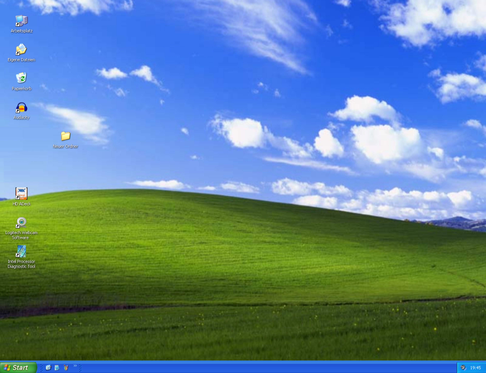

# Acciacca Prof Reloaded

Acciacca Prof Reloaded e' il ritorno di un gioco nato in ambiente scolastico nel 2007 e scritto originariamente in Delphi per Windows XP.

Questo repository contiene:
- il porting iOS in SwiftUI/SpriteKit
- la versione web giocabile ispirata alla `Form1` originale Delphi
- asset, note e materiali di supporto usati per ricostruire grafica, coordinate, layering e gameplay
- API PHP locali per sessioni protette, classifica e streaming video

## Cos'e'

Il gioco riprende la logica di "schiaccia la talpa", ma ambientata in un'aula scolastica:
- dai banchi compaiono i prof
- alcuni vanno colpiti, altri no
- gli errori abbassano il punteggio e il voto
- ai tre livelli classici si aggiunge il Pentathlon con 5 prove speciali

L'obiettivo di questo repo non e' solo "rifare il gioco", ma conservarne anche atmosfera, coordinate, grafiche, suoni e UI il piu fedelmente possibile.

## Screenshot

### Web desktop shell


### Grafica originale


### Landing / storia


### Versione iPhone


## Storia

Nel 2007 non esistevano ancora le app come le intendiamo oggi. In quel contesto nacque Acciacca Prof: un piccolo gioco scritto in Delphi per Windows XP, con spirito goliardico da ricreazione scolastica, diffuso tra compagni di scuola e sul forum del liceo.

Nel 2026 il progetto e' stato riportato in vita con un doppio obiettivo:
- ricostruire il gioco su iPhone
- creare anche una versione web fedele alla grafica e al feeling originale

Nel repository trovi quindi sia il porting moderno, sia la parte "museale": asset, copie del layout, note sul Pentathlon, coordinate e riferimenti al comportamento storico.

## Funzionalita principali

- Gameplay classico a tre livelli
- Prof cattivi, prof buoni e bidella
- Voto finale e punteggio
- Personalizzazioni personaggi
- Pentathlon completo a 5 prove
- Desktop shell stile Windows XP nella versione web
- Riposizionamento e layering derivati dai riferimenti Delphi/iOS

## Struttura del repository

```text
.
├── ios/
│   ├── AcciaccaProf/
│   │   ├── AcciaccaProf/          # codice app iOS
│   │   └── Resources/             # asset e risorse Xcode
│   ├── PENTATHLON_NOTES.md        # note sulle prove del Pentathlon
│   └── README.md                  # note specifiche sul porting iOS
├── web/
    ├── index.html                 # landing / pagina pubblica
    ├── play.html                  # gioco web
    ├── api/                       # login/session/logout, leaderboard, streaming media
    ├── resources/                 # asset grafici, audio, cursori, wallpaper
    └── app/                       # privacy policy / supporto
├── data/                         # classifica JSON locale
└── media/                        # video locali pubblici e riservati (fuori Git)
```

## Avvio rapido

### Web

La versione web richiede PHP, perche' usa endpoint locali per sessioni, classifica e streaming video.

Avvio consigliato dalla root del repository:

```bash
php -S 127.0.0.1:4183 -t web
```

Poi apri:

```text
http://127.0.0.1:4183/play.html
```

Configurazione della sessione `VA`:

```text
web/api/config.local.php
```

Parti da:

```text
web/api/config.local.php.example
```

I video non sono versionati in Git. Vanno messi qui:

```text
media/public/
media/va/
```

e vengono serviti tramite:

```text
web/api/media.php?id=...
```

In questo modo il video riservato `VA` resta protetto dalla sessione PHP e non e' esposto come file statico sotto `web/`.

### iOS

Il porting iOS si trova in `ios/AcciaccaProf/`.

Se apri il progetto in Xcode:
- verifica che le risorse siano nel bundle
- controlla i target membership degli asset audio/grafici
- usa `ios/AcciaccaProf/README.md` per le note specifiche del porting

## Stato del progetto

### Web

La versione web include:
- shell desktop XP
- finestra di gioco trascinabile
- gameplay classico
- Pentathlon integrato sulla griglia di gioco
- menu Start, icona desktop e onboarding narrativo a pagine
- login a sessioni `Generica` / `VA`
- classifica persistente lato PHP
- archivio video locale con controllo accessi sulla sessione `VA`

### iOS

La versione iOS e' il riferimento principale per la logica moderna:
- SpriteKit per scena e timing
- Pentathlon completo
- copy di onboarding e supporto alla personalizzazione

La versione Reloaded non e' mai stata pubblicata su App Store: Apple non l'ha approvata richiamando la linea guida `1.1.1`, sostenendo che il gioco incoraggerebbe il danno fisico e umilierebbe la categoria degli insegnanti. Questa lettura non corrisponde allo spirito con cui il progetto e' nato, cioe' come giochino ironico e goliardico da contesto scolastico. Resta comunque possibile scaricare questo repository, aprire il progetto iOS in Xcode e installare l'app sul proprio dispositivo in autonomia.

## Note di fedelta

Durante il porting web sono stati usati come riferimenti:
- coordinate e layering Delphi
- logiche di gioco iOS
- asset originali dell'aula e dei personaggi

Questo significa che alcune parti non sono "reinventate per il web", ma ricostruite per assomigliare il piu possibile al comportamento storico o al porting iOS gia esistente.

## Link utili

- Sito / landing web: `web/index.html`
- Gioco web: `web/play.html`

## Licenza / note

Questo repository contiene materiale storico, porting moderni e asset del progetto Acciacca Prof Reloaded. Se vuoi pubblicarlo o riutilizzarlo in un contesto diverso, conviene chiarire prima licenza, provenienza degli asset e modalita di distribuzione.
